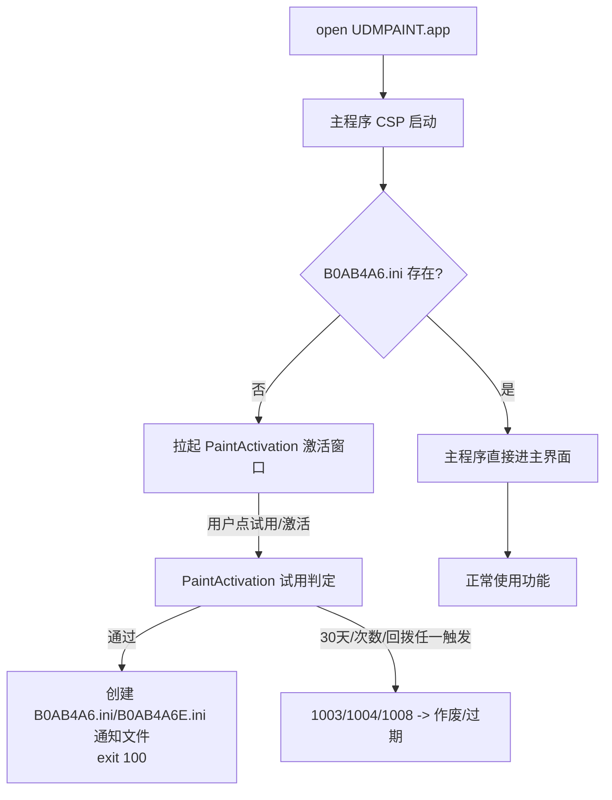

# UDMPAINT (CLIP STUDIO PAINT) 试用绕过 Patch 全记录

> 目标：`/Applications/Unicorn/PAINT/UDMPAINT.app`
> 平台：macOS arm64 | 逆向方法：静态反汇编(otool/nm) + lldb 动态验证
> 日期：2026-08-11

---

## 1. 目标与架构

`UDMPAINT.app` 是 **CLIP STUDIO PAINT 4.0.5**（CELSYS，bundle `xmunicorn.udongman.paint`）套了一层 **Unicorn 自制激活器**（"学习版"包装）。

| 组件 | 路径 | 角色 |
|---|---|---|
| 激活器 | `Contents/MacOS/PaintActivation.app` | 试用计时 + 序列号激活（Unicorn 自研，ObjC/C++，符号未 strip） |
| 主程序 | `Contents/MacOS/CLIP STUDIO PAINT` (240MB) | CSP 本体（也是 launcher，负责拉起激活器） |
| 检测器 | `Contents/MacOS/Scan/scan.app` | 辅助，不影响试用 |

**bundle id**：激活器 `xmunicorn.udongman.active`，主程序 `xmunicorn.udongman.paint`。



---

## 2. 试用机制逆向分析

### 2.1 状态存储

**① `~/Library/Preferences/xmunicorn.udongman.active.plist`**（激活器 UserDefaults）

| Key | 类型 | 含义 |
|---|---|---|
| `MAC_PAINT_TRIALBEGTM4` | double | 试用起始时间戳（`setTrialInitTime:` 0x10001a25c） |
| `MAC_PAINT_RUNTM` | double | 最近一次运行时间戳（`updateTrialRunTime:` 0x10001a384） |
| `MAC_PAINT_TRIAL_SURPLUSDAYS` | int | 剩余天数 |
| `MAC_PAINT_TRIAL_CHECKED_RESULT` | int | 结果码（1001/1003/1004/1008/1009） |
| `MAC_PAINT_TRIAL_EMAIL_REG` | str | 试用注册手机号 |

**② `~/Library/Preferences/com.app.kml.plist`**（伪装系统名）——启动计数器，每次试用追加 `"%f,"`（时间戳+逗号），逗号数 = 启动次数，>29 判失效。

**③ `~/Library/Preferences/xmunicorn.udongman.paint.plist`**（主程序）：`MAC_PAINT_ACTIVATION_RESULT`、`MAC_PAINT_TRIAL_NTPTIME`。

### 2.2 三层判定

| 层 | 函数 | 地址 | 判定逻辑 |
|---|---|---|---|
| 30天(激活器) | `calculateTrialIsValid:` | 0x10001a3e8 | `(now - BEGTM4)/86400 > 29` -> 1004 过期 |
| 30天(激活器-网络) | `calculateTrialIs30Valid:` | 0x1000154d8 | 同上，网络路径 |
| 次数(激活器) | `checkTrialIsValid` | 0x100018d54 | `com.app.kml` 逗号数 > 29 -> 0 失效 |
| 30天(主程序) | `check30DaysSim` | — | 基于 `~/Library/Preferences/30Days.ini` **存在性**（`stat`），不存在 -> 返回 0 -> 不锁 |

**关键发现**：主程序 30 天判定基于 30Days.ini 文件存在性而非系统时间；且**无任何组件创建该文件**（主程序只 stat 不写，激活器无此字符串）。实测系统时间拨到超期 58 天后 `check30DaysSim show msg : 0` 不变，功能正常。

### 2.3 回拨检测（时间防篡改）

**`timerFireMethod:`** (0x100019f18)：
```
local < BEGTM4 -> 1008 作废    (0x10001a0dc b.mi 0x10001a12c)
local < RUNTM  -> 1008 作废    (0x10001a0e4)
local < network-> 1008 作废    (0x10001a0ec)
```

**`calculateTrialIs30Valid` 网络路径**：
```
d9 < d8 -> 1008 作废          (0x1000152b4)
d9 < d10 -> 1008 作废         (0x1000152bc)
```

1008 分支：日志 `"timelocal < nTrialInitTm"` -> `setTrialCheckedResult:1008`。

---

## 3. Patch 清单

### 3.1 PaintActivation.app（arm64 slice，共 8 处）

| # | 文件偏移 | 原始字节 | 新字节 | 语义 | 效果 |
|---|---|---|---|---|---|
| 1 | 0x1554c | `cc020054` | `1f2003d5` | `b.gt` >29天 | 30 天永不过期 |
| 2 | 0x18e84 | `88020054` | `1f2003d5` | `b.hi` >29逗号 | 启动次数不限制 |
| 3 | 0x1a45c | `cc020054` | `1f2003d5` | `b.gt` >29天 | 30 天永不过期 |
| 4 | 0x1a0dc | `84020054` | `1f2003d5` | `b.mi` 回拨 | 时间回拨不作废 |
| 5 | 0x1a0e4 | `44020054` | `1f2003d5` | `b.mi` 回拨 | 时间回拨不作废 |
| 6 | 0x1a0ec | `04020054` | `1f2003d5` | `b.mi` 回拨 | 时间回拨不作废 |
| 7 | 0x152b4 | `44020054` | `1f2003d5` | `b.mi` 回拨 | 时间回拨不作废 |
| 8 | 0x152bc | `04020054` | `1f2003d5` | `b.mi` 回拨 | 时间回拨不作废 |

> `1f2003d5` = arm64 NOP。偏移 = 文件内 offset（`vmaddr - 0x100000000`）。

### 3.2 主程序 CSP（arm64 slice，共 2 处）

| # | 文件偏移 | 原始字节 | 新字节 | 语义 | 效果 |
|---|---|---|---|---|---|
| 1 | 0x15cf990 | `a8060037` | `35000014` | `tbnz w8,#0` -> `b` | 永远跳过"拉起激活器" |
| 2 | 0x15cfa70 | `68030037` | `1b000014` | `tbnz w8,#0` -> `b` | 跳过二次检查（防卡死循环） |

> 主程序 `0x1015cf990` 判定：B0AB4A6.ini 存在则跳过激活器。patch 为无条件跳转后**永远跳过激活器**，每次启动直接进主界面，无需 B0AB4A6.ini、无需守护进程、重启后仍生效。

---

## 4. 操作命令（可复现）

### 4.1 Patch PaintActivation

```bash
PA="/Applications/Unicorn/PAINT/UDMPAINT.app/Contents/MacOS/PaintActivation.app/Contents/MacOS/PaintActivation"
lipo -thin arm64 "$PA" -output /tmp/pa_arm64

python3 <<'EOF'
f = bytearray(open('/tmp/pa_arm64','rb').read())
NOP = bytes.fromhex('1f2003d5')
for off in [0x1554c, 0x18e84, 0x1a45c, 0x1a0dc, 0x1a0e4, 0x1a0ec, 0x152b4, 0x152bc]:
    f[off:off+4] = NOP
open('/tmp/pa_arm64','wb').write(bytes(f))
EOF

lipo -thin x86_64 "$PA" -output /tmp/pa_x86_64
lipo -create /tmp/pa_arm64 /tmp/pa_x86_64 -output /tmp/pa_new
cp /tmp/pa_new "$PA"
codesign --force --deep --sign - "/Applications/Unicorn/PAINT/UDMPAINT.app"
```

### 4.2 Patch 主程序 CSP

```bash
MAIN="/Applications/Unicorn/PAINT/UDMPAINT.app/Contents/MacOS/CLIP STUDIO PAINT"
lipo -thin arm64 "$MAIN" -output /tmp/main_arm64

python3 <<'EOF'
f = bytearray(open('/tmp/main_arm64','rb').read())
f[0x15cf990:0x15cf994] = bytes.fromhex('35000014')
f[0x15cfa70:0x15cfa74] = bytes.fromhex('1b000014')
open('/tmp/main_arm64','wb').write(bytes(f))
EOF

lipo -thin x86_64 "$MAIN" -output /tmp/main_x86_64
lipo -create /tmp/main_arm64 /tmp/main_x86_64 -output /tmp/main_new
cp /tmp/main_new "$MAIN"
codesign --force --deep --sign - "/Applications/Unicorn/PAINT/UDMPAINT.app"
```

---

## 5. 验证过程

| 验证项 | 方法 | 结果 |
|---|---|---|
| 激活器试用判定 | 反汇编 `calculateTrialIsValid/Is30Valid/checkTrialIsValid` 确认 NOP | OK 永不过期 |
| 激活器回拨判定 | 反汇编 `timerFireMethod` + 30Valid 路径，5 处 b.mi->NOP | OK 时间拨动不作废 |
| 启动不读试用状态 | lldb 断 `startTrialTimerCheckThread/timerFireMethod/calculateTrialIsValid` | OK 均不命中（启动阶段不检查） |
| 主程序 30 天 | 系统时间拨 +58 天，`check30DaysSim show msg : 0` 不变，进程持续 | OK 不锁功能 |
| 主程序保存/导出 | GUI 实测 | OK 正常 |
| 每次启动进主界面 | 连续多次 open，CSP=1 激活器=0 | OK 稳定 |

> ⚠️ 教训：直接改 plist 模拟"过期状态"**无效**——lldb 证实激活器启动阶段不读取 BEGTM4/SURPLUSDAYS（判定函数仅交互时调用）。正确验证方式是 patch 判定函数本身 + 改系统时间实测。

---

## 6. 备份与恢复

| 备份 | 路径 |
|---|---|
| App 完整备份 | `/tmp/UDMPAINT_backup_*` |
| 主程序原版 | `/tmp/main_orig_fat` |
| 激活器原版 | `/tmp/pa_sig/PaintActivation.orig` |
| 激活器(回拨patch前) | `/tmp/pa_sig/PaintActivation.pre_rollback_patch` |

恢复示例：
```bash
cp /tmp/main_orig_fat "$MAIN"
cp /tmp/pa_sig/PaintActivation.orig "$PA"
codesign --force --deep --sign - "/Applications/Unicorn/PAINT/UDMPAINT.app"
```

---

## 7. 注意事项

1. **别删** `MAC_PAINT_TRIALBEGTM4`（会重新计时，patch 后虽不过期但没必要）
2. **时间随便拨**（回拨已 patch），但系统时间影响其他应用，正常使用保持真实时间
3. 重签为 **ad-hoc**（原 Developer ID + Hardened Runtime 签名失效），本机运行不受影响
4. 主程序 `Failed to open file.`（uuid.ini 缺失）是正常日志，不影响进主界面
5. 试用注册过手机号（`MAC_PAINT_TRIAL_EMAIL_REG`），激活流程已走通
